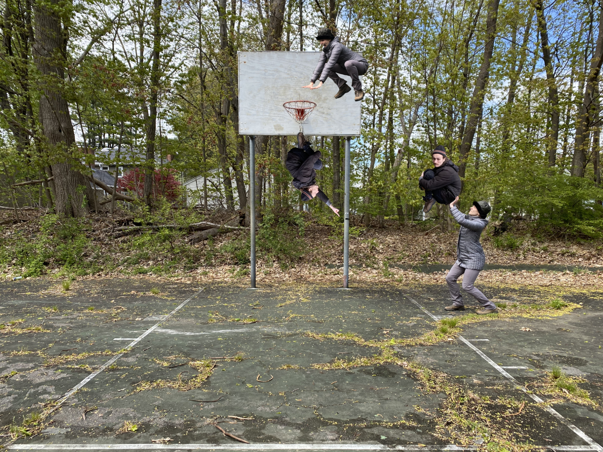

Court closed, so play at your own risk. And don't use a ball. They're unsanitary.

Studies have shown that studies showing whether studies on basketball's effects on health of the human bean are positive 85% of the time, so eat your beans, and play ball (except for the other third of the time). That's what we do!

