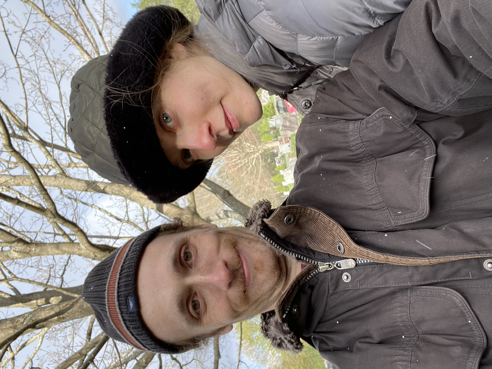

### Hi! 

We are Tacko and Jebia, and we're excited to offer to you our self-guided tour of South Natick. Perfect for Sundays in early May. With our great guide, you'll be sure to see all the sights we think you should see. And we think that's just great!

Let's go on an adventure! Be sure to keep your neat-o map handy. 

_Warning: walking may have unexpected side effects. Unexpected effects are unexpected, so we don't expect them. But, adventure at your own risk. Oh, and if you feel like you want to touch anything, maybe don't. Or consider using a stick or something.  We like sharing exciting tips about your walk around South Natick, we are not all that into sharing viruses._

## Now get ready to get walking 
Like this (be sure to have your tick gaiters on, if you want to look as cool as us!):

Oh, and as to _where_ to walk? Follow your Guide. 
We'll guide you!  